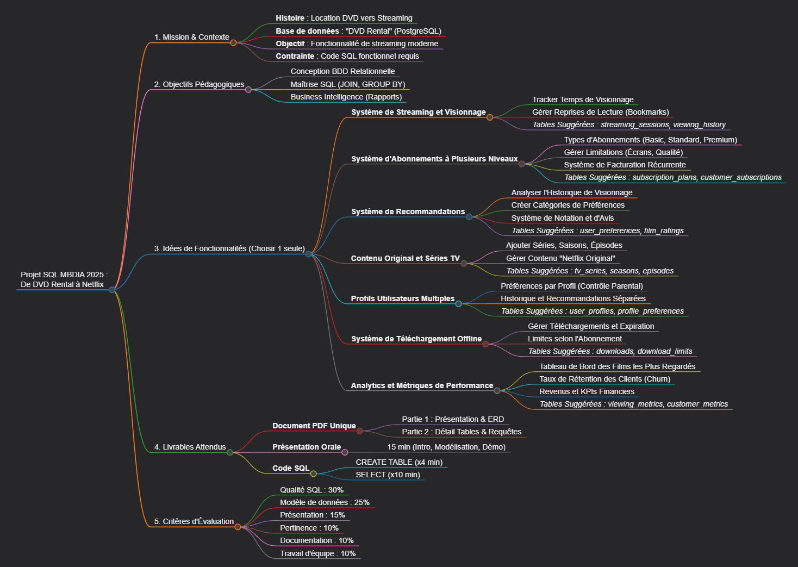

# 🎬 Projet SQL : De DVD Rental à Netflix (MBDIA 2025)

Bienvenue sur le repository de notre projet de groupe. Ce projet vise à transformer une base de données relationnelle de location de DVD physique vers un modèle de streaming moderne (VOD).

**📅 Deadline du rendu :** 12 janvier 2026 à 9h30
**🎯 Objectif :** Concevoir une fonctionnalité majeure, implémenter les tables SQL, et générer des rapports métiers.

---

## 👥 Répartition des Rôles (La "Squad")

Pour être efficaces, nous avons réparti les responsabilités techniques. Chacun contribue au code SQL, mais avec une spécialité :

| Rôle | Membres | Responsabilités Principales |
| :--- | :--- | :--- |
| **Lead Architect** | *[Nom 1]* | Responsable du schéma de base de données (ERD), validation des clés étrangères et de la cohérence globale. Garante des "bonnes pratiques" SQL. |
| **Data Engineers** | *[Nom 2], [Nom 3]* | Création des nouvelles tables (`CREATE TABLE`). **Crucial :** Génération des données fictives (Mock Data) pour avoir au moins 10 lignes cohérentes par table. |
| **Data Analysts** | *[Clément], [Mathieu]* | Rédaction des requêtes d'exploitation (`SELECT`, `JOIN`, `GROUP BY`). Création des indicateurs de performance (KPIs) et rapports métiers. |
| **Product Owner / Doc** | *[Nom 6]* | Gestion du livrable final (PDF) et de la présentation. Coordination de l'équipe et vérification de l'adéquation avec le besoin métier. |

---

## 🗺️ Roadmap du Projet

Nous travaillons en méthode Agile simplifiée.

### 📍 Semaine 1 : Conception & Modélisation
- [ ] Choix définitif de la fonctionnalité (ex: Abonnements ou Historique Streaming).
- [ ] Création du diagramme Entité-Relation (ERD) sur `dbdiagram.io`.
- [ ] Liste définitive des 4 à 10 nouvelles tables à créer.
- [ ] Validation du modèle par le Lead Architect.

### 📍 Semaine 2 : Construction (Data Engineering)
- [ ] Écriture des scripts `CREATE TABLE`.
- [ ] Insertion des jeux de données (Data Seeding) : ~10-50 lignes par table.
- [ ] Test des relations entre les nouvelles tables et l'ancienne base `DVD Rental`.

### 📍 Semaine 3 : Exploitation (Data Analysis)
- [ ] Écriture des 10-15 requêtes `SELECT` complexes.
- [ ] Validation des critères techniques : au moins 4 `JOIN` et 3 `GROUP BY`.
- [ ] Analyse des résultats : est-ce que les chiffres sortis ont du sens ?

### 📍 Semaine 4 : Finalisation & Rendu
- [ ] Compilation de la documentation PDF (Partie 1 & 2).
- [ ] Prise des screenshots des tables et des résultats de requêtes.
- [ ] Préparation des slides de présentation.
- [ ] Répétition orale.

---

## 🛠️ Comment travailler sur ce projet ?

1.  **Ne jamais coder sur `main`** : La branche `main` est pour le code validé uniquement.
2.  **Créer une branche** : Pour chaque tâche, créez une branche : `git checkout -b feature/nom-de-la-tache`.
3.  **Pull Request (PR)** : Une fois le code fini, poussez votre branche et ouvrez une PR sur GitHub pour relecture.
4.  **Conventions SQL** :
    * Noms des tables : `snake_case` et au pluriel (ex: `user_subscriptions`).
    * Mots clés SQL en MAJUSCULES (ex: `SELECT * FROM`).

## 📚 Ressources
* [Enoncé du projet (PDF)](./Projet-SQL-MBDIA-2025.pdf)
* [Documentation PostgreSQL](https://www.postgresql.org/docs/)
* [Outil de diagramme (dbdiagram.io)](https://dbdiagram.io)
